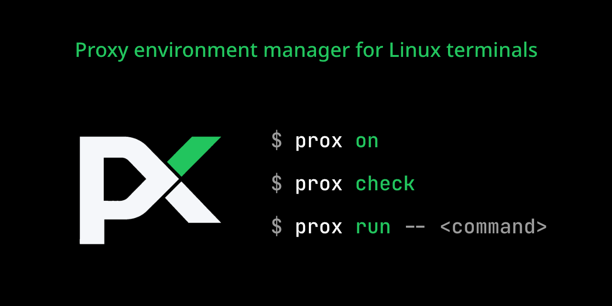

# prox



`prox` 为 Linux 终端提供一套简单、可靠、可诊断的代理开关。

它不提供代理服务，也不管理 Clash、V2Ray、企业代理或 VPN。它只负责安全地设置当前终端及其子进程使用的代理环境变量，并检查配置的代理是否可用。

> 当前版本：V0.2.0，支持 Linux、Bash 4.3+ 和 HTTP Proxy。

## 为什么需要 prox

将代理永久写入 `.bashrc` 很方便，但代理应用退出后，Git、curl 和包管理器仍会尝试连接已经失效的端口。

`prox` 将日常操作统一为：

```bash
prox on
prox off
prox status
prox check
prox run -- <command>
```

其中 `prox run` 只影响指定命令，是最推荐的使用方式。

## 功能

- 启用前检查代理端点，失败时不修改当前环境；
- 关闭时恢复启用前的变量，而不是无条件清空；
- 检测代理变量在启用后是否被其他操作修改；
- 区分“当前 Shell 已启用代理”和“代理网络健康”；
- 通过代理执行真实 HTTP/HTTPS 健康检查；
- 只为一条命令及其子进程提供代理；
- 不依赖 curl、nc、jq 或后台守护进程；
- 不收集遥测数据。

## 安装

### 安装脚本（推荐）

安装最新 GitHub Release 到 `~/.local/bin`：

```bash
curl -fsSL https://raw.githubusercontent.com/luhuadong/prox/main/scripts/install.sh | sh
```

安装器会检测 Linux CPU 架构、下载对应的预编译包并验证 SHA-256 校验和。它不会修改 Shell 配置或创建代理配置文件。

每个 Release 也提供可直接交给系统包管理器安装的 `.deb` 和 `.rpm` 文件；系统包会同时安装 Bash completion。

安装指定版本或目录：

```bash
curl -fsSL https://raw.githubusercontent.com/luhuadong/prox/main/scripts/install.sh |
  sh -s -- --version v0.2.0 --bin-dir "$HOME/.local/bin"
```

如果希望先审阅脚本：

```bash
curl -fsSLO https://raw.githubusercontent.com/luhuadong/prox/main/scripts/install.sh
less install.sh
sh install.sh
```

确保 `~/.local/bin` 位于 `PATH` 中。

### 使用 Go 安装

已经安装 Go 1.22 或更高版本时：

```bash
go install github.com/luhuadong/prox/cmd/prox@latest
```

确保 `$(go env GOPATH)/bin` 位于 `PATH` 中。

### 从源码安装

要求：

- Linux；
- Go 1.22 或更高版本；
- Bash 4.3 或更高版本。

```bash
git clone https://github.com/luhuadong/prox.git
cd prox
make check
make install PREFIX="$HOME/.local"
```

只构建而不安装：

```bash
make build
```

生成的二进制位于 `dist/prox`。

### 更新与卸载

重新运行安装脚本即可更新。卸载用户级安装：

```bash
rm "$HOME/.local/bin/prox"
```

源码安装也可以使用对应目录执行：

```bash
make uninstall PREFIX="$HOME/.local"
```

## Bash 集成（仅 on/off 需要）

`prox check` 和 `prox run` 安装后可以直接使用。只有 `prox on`、`prox off` 和准确显示当前 Shell 激活状态的 `prox status` 需要加载 Shell Hook。

先在当前终端测试：

```bash
eval "$(prox init bash)"
```

如果工作正常，将同一行加入 `~/.bashrc`：

```bash
eval "$(prox init bash)"
```

然后重新加载：

```bash
source ~/.bashrc
```

这里加载的只是 Shell Hook，不会自动开启代理，也不会访问网络。

Shell Hook 同时启用 Bash completion。也可以单独输出 completion，交给其他安装方式管理：

```bash
prox completion bash
```

## 快速开始

无需创建配置文件即可检查默认代理端点：

```bash
prox check --local
prox run -- curl https://www.google.com
```

### 检查代理

```bash
prox check
```

默认检查：

1. 配置是否合法；
2. `127.0.0.1:7890` 是否可以建立 TCP 连接；
3. 能否显式通过该代理访问 Google 的 `generate_204` 地址；
4. 是否返回预期的 HTTP 204。

示例输出：

```text
Proxy: http://127.0.0.1:7890

PASS  Config      valid
PASS  Endpoint    127.0.0.1:7890 reachable  1 ms
PASS  Internet    www.google.com returned HTTP 204  316 ms

Proxy is healthy.
```

只检查代理端口，不访问外网：

```bash
prox check --local
```

临时指定其他检查地址：

```bash
prox check --url https://github.com
```

脚本中只使用退出状态：

```bash
if prox check --quiet; then
    echo "proxy is healthy"
fi
```

### 为当前终端启用代理

```bash
prox on
```

`prox on` 只执行快速端点检查。代理端点不可达时，它会返回失败，并保证当前环境不变。

查看当前 Shell 状态：

```bash
prox status
```

关闭并恢复原环境：

```bash
prox off
```

如果启用前已经存在公司代理等配置，`prox off` 会恢复原值，而不是将其删除。

### 只为一条命令使用代理

```bash
prox run -- git clone https://github.com/example/project.git
prox run -- curl https://www.google.com
```

`prox run` 不修改当前 Shell。代理端点检查成功后，`prox` 会在 Linux 上将自身替换为目标命令，因此目标命令保持原有的输入输出、信号和退出状态语义。

## 配置

配置文件默认位于：

```text
${XDG_CONFIG_HOME}/prox/config.json
```

如果没有设置 `XDG_CONFIG_HOME`：

```text
~/.config/prox/config.json
```

安装脚本、Go 安装、源码安装、deb 和 rpm 都不会自动创建用户配置文件。配置文件不存在时，`prox` 使用内置默认值，不会报错。

查看默认路径：

```bash
prox config path
```

查看合并内置默认值后的完整配置：

```bash
prox config show
```

如果默认代理地址不适用，创建最小用户配置：

```bash
prox config init --proxy http://127.0.0.1:7897
```

不传 `--proxy` 时会写入默认地址 `http://127.0.0.1:7890`。生成的最小配置为：

```json
{
  "proxy_url": "http://127.0.0.1:7897"
}
```

其他字段继续继承内置默认值。配置以权限 `0600` 创建，已有文件不会被覆盖。确认配置合法：

```bash
prox config validate
```

需要明确替换已有文件时可以执行：

```bash
prox config init --proxy http://127.0.0.1:7897 --force
```

所有字段都是可选的：

| 字段 | 内置默认值 | 说明 |
| --- | --- | --- |
| `proxy_url` | `http://127.0.0.1:7890` | 当前使用的 HTTP Proxy URL |
| `no_proxy` | `localhost,127.0.0.1,::1,.local` | 不经过代理的主机或域名列表 |
| `check_url` | `https://www.google.com/generate_204` | 完整健康检查访问的地址 |
| `expected_status` | `204` | 默认检查期望的 HTTP 状态码 |
| `connect_timeout` | `2s` | 连接代理端点的超时时间 |
| `request_timeout` | `8s` | 完整 HTTP 检查的超时时间 |

完整示例：

```json
{
  "proxy_url": "http://127.0.0.1:7890",
  "no_proxy": [
    "localhost",
    "127.0.0.1",
    "::1",
    ".local"
  ],
  "check_url": "https://www.google.com/generate_204",
  "expected_status": 204,
  "connect_timeout": "2s",
  "request_timeout": "8s"
}
```

配置使用严格 JSON：未知字段、多余 JSON 值、非法 URL 或非正数超时都会报错。超时使用 Go duration 格式，例如 `500ms`、`2s`、`1m`。当前只接受不带认证信息的 `http://` 代理地址。

也可以为单次操作指定配置文件：

```bash
prox --config /path/to/config.json config init
prox --config /path/to/config.json check
prox --config /path/to/config.json on
```

`--config PATH` 会选择另一份配置文件，不会再读取或合并默认用户配置文件；配置文件中省略的字段仍继承内置默认值。未传 `--config` 时使用默认用户配置文件。当前版本只支持一份配置，不支持命名 Profile。

## 设置的环境变量

`prox on` 和 `prox run` 设置：

```text
http_proxy
https_proxy
all_proxy
HTTPS_PROXY
ALL_PROXY
no_proxy
NO_PROXY
```

当前版本不设置或删除大写 `HTTP_PROXY`。如果它已经存在，`prox on` 会给出警告。

代理环境变量是广泛使用的事实约定，但并非所有程序都会读取它们。`prox` 不修改以下持久配置：

- `git config --global http.proxy`；
- npm 或 pip 的代理配置；
- Docker daemon；
- systemd 服务；
- 桌面系统代理；
- `sudo` 的环境保留规则。

## 状态与健康

`prox status` 只检查当前 Shell 中的状态，不访问网络：

```text
State: inactive
```

```text
State: active
Proxy: http://127.0.0.1:7890
Health: not checked
```

如果代理变量在 `prox on` 后被手动修改：

```text
State: drifted
```

此时执行 `prox off` 会给出警告，并恢复启用前的环境快照。

## 退出状态

普通管理命令：

| 状态 | 含义 |
| ---: | --- |
| `0` | 成功；`check` 表示检查通过 |
| `1` | 操作失败或健康检查未通过 |
| `2` | 命令参数或配置错误 |

`prox run`：

- 启动目标命令前的代理错误返回 `125`；
- 目标命令不存在返回 `127`；
- 目标命令启动后，退出状态由目标命令决定。

## 当前限制

当前版本暂不支持：

- SOCKS5 / SOCKS5H；
- 多 Profile；
- Zsh、Fish、PowerShell；
- 代理认证；
- PAC；
- 自动探测代理应用；
- 后台监控；
- 自动修改 `.bashrc`；
- macOS 和 Windows。

这些边界是有意设置的，目的是保持终端代理开关和检查体验简单、可预测。

## 工程结构

```text
cmd/prox/            CLI 入口
internal/app/        命令调度与输出
internal/config/     配置加载和校验
internal/health/     TCP 与 HTTP 健康检查
internal/runner/     Linux 目标进程替换
internal/shell/      环境计算和 Bash Hook
scripts/             安装脚本
tests/               Shell 集成测试
docs/                产品与技术文档
.github/workflows/   持续集成与 Release 发布
```

核心程序使用 Go；Bash Hook 只负责修改当前 Shell、保存环境快照和恢复原状态。

## 开发

```bash
make fmt
make test
make vet
make check
make release-check
make snapshot
```

测试包括：

- 配置覆盖与严格解析；
- HTTP Proxy URL 校验；
- IPv6 端点生成；
- TCP 端点成功和失败；
- 显式代理请求不受 `NO_PROXY` 干扰；
- HTTP 状态码检查；
- Bash 环境快照、幂等启用、漂移检测和恢复。

### Module Path

```text
github.com/luhuadong/prox
```

## 安全

发现安全问题时，请不要公开披露利用细节。参见 [SECURITY.md](SECURITY.md)，或发送邮件至 [luhuadong@163.com](mailto:luhuadong@163.com)。

## License

Copyright 2026 prox contributors.

Licensed under the Apache License, Version 2.0. See [LICENSE](LICENSE).
